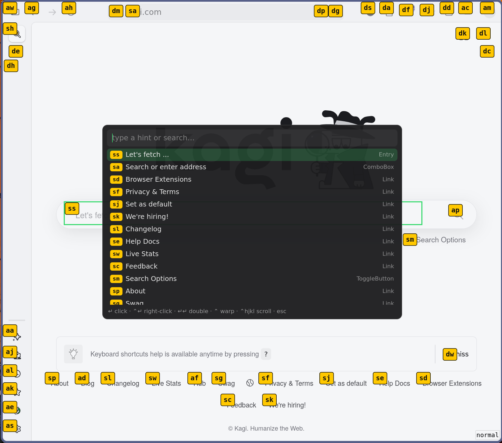

# peck

Vimium-style mouseless navigation for [Niri](https://github.com/YaLTeR/niri).

> [!IMPORTANT]
> This is experimental software. Expect things to break.



## Prerequisites

### Niri version

As of writing, Niri does not expose the absolute coordinates of tiled windows, which would make the overlay positioning impossible.
The currently open pull request [ipc: expose workspace scrolling view position](https://github.com/niri-wm/niri/pull/4147) makes deriving the absolute coordinates of tiled windows possible via the new `scrolling_view_pos` field in the IPC protocol.

If you are on NixOS, you can switch to this fork using the following override:
```nix
pkgs.niri.overrideAttrs (_: {
  src = pkgs.fetchFromGitHub {
    owner = "kiryl";
    repo = "niri";
    rev = "d26ab5f29df670110a91a7e933a743eeaf611978";
    hash = "sha256-3HxntJA2DNg+L94gbM86uGeJqPPWbSX88CjteOmYV0o=";
  };
});
```

### Accessibility

In order for this application to work, `at-spi2-core` needs to be running.
On NixOS, you can enable it using the following configuration:
```nix
services.gnome.at-spi2-core.enable = true;
```

With the bus running, some apps still need to be told to export their accessibility trees:
```nix
dconf.settings."org/gnome/desktop/interface".toolkit-accessibility = true;
```

## Usage

`peck daemon` runs a persistent background process.
`peck activate` triggers a single activation against the currently focused window.
Run the daemon at startup and bind `activate` to your preferred keybind in your Niri config:

```kdl
spawn-at-startup "peck" "daemon"

binds {
    Mod+Shift+Space { spawn "peck" "activate"; }
}
```

The `--mode` flag can be used to specify the action that should be taken on selection.
This includes:
- `panel` (default)
- `left_click`
- `right_click`
- `double_click`
- `middle_click`
- `warp`

`panel` mode is the default and provides a fuzzy-searchable view of accessible elements.
Other modes provide the hints interface without the fuzzy search.

## Inspiration / Related Work

- [ShortCat](https://shortcat.app/) (proprietary, MacOS only)
- [Hints](https://github.com/AlfredoSequeida/hints)
